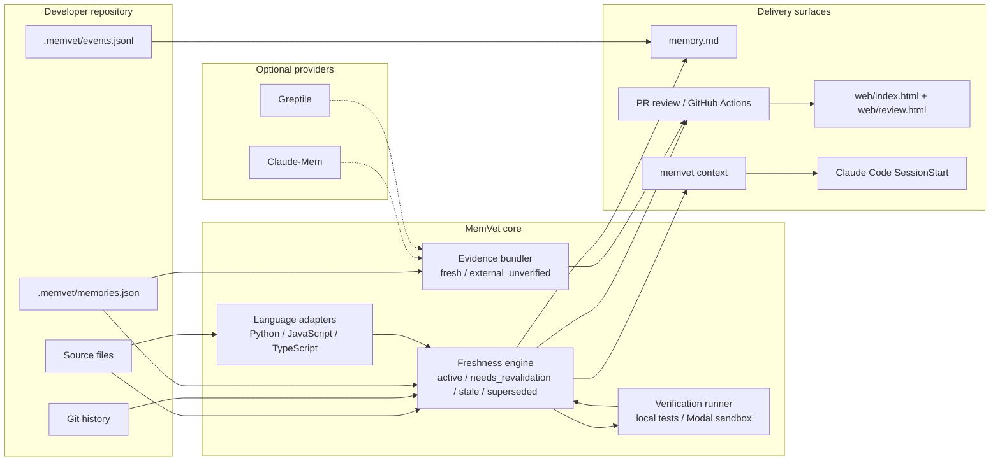

# MemVet

MemVet keeps engineering knowledge tied to the codebase.

AI coding agents can retrieve an old decision, workaround, or failed approach and treat it as current even after the repository has changed. MemVet binds memories to Git commits and tracked files, detects drift, and generates a human-readable `memory.md` view.

## Status

Early open-source prototype with symbol-aware freshness, explainable PR reviews, trust-labeled provider evidence, test-backed verification, and append-only decision history. Claude-Mem, Greptile, and Modal integrations remain optional.

Version `0.2.0` adds JavaScript/TypeScript adapters, provenance-rich verification evidence, and optional LangGraph orchestration. See `CHANGELOG.md` for the release scope.

## Architecture

MemVet is local-first by design. The core freshness decision comes from the repository, not from a hosted model or external memory provider.



- **Ledger:** `.memvet/memories.json` is the source of truth for decisions, tracked files, tracked symbols, recorded tests, introduction commits, verification commits, and supersession state. `memory.md` is a generated human-readable view.
- **Git boundary:** each record is checked against the commit where it was introduced. If the commit, tracked file, or relevant symbol no longer exists, the record becomes stale or requires review.
- **Symbol adapters:** supported Python, JavaScript, and TypeScript files are indexed into qualified symbols with normalized body hashes, so unrelated edits in the same file do not invalidate a memory.
- **Freshness engine:** `memvet check`, `memvet audit`, and `memvet review` all call the same status logic and return explainable reasons instead of opaque confidence scores.
- **Verification:** recorded tests can run locally or in a Modal sandbox before a memory is marked verified at the current commit.
- **Evidence adapters:** Claude-Mem and Greptile can add historical or code-search context, but their output stays labeled as external evidence until local Git and tests validate it.
- **Delivery:** MemVet publishes agent context through `memvet context`, pull-request comments through GitHub Actions, JSON reports for the static web viewer, and an optional Claude Code `SessionStart` hook.

## Quick start

```bash
python -m venv .venv
source .venv/bin/activate
python -m pip install -e .
memvet init
memvet remember \
  --id decision-001 \
  --title "Keep coupon validation at the API boundary" \
  --content "Mobile clients do not validate coupons, so the API must remain authoritative." \
  --file src/api/discounts.py \
  --symbol validate_coupon \
  --test tests/test_expired_coupon.py
memvet check
```

Create `.memvet/memories.json` entries like:

```json
{
  "version": 1,
  "memories": [
    {
      "id": "decision-001",
      "title": "Keep coupon validation at the API boundary",
      "content": "Mobile clients do not validate coupons, so the API must remain authoritative.",
      "introduced_commit": "<commit-sha>",
      "files": ["src/api/discounts.py"],
      "symbols": ["validate_coupon"],
      "symbol_hashes": {"validate_coupon": "<sha256>"},
      "tests": ["tests/test_expired_coupon.py"],
      "status": "active"
    }
  ]
}
```

When a tracked file changes, `memvet check` reports `needs_revalidation`. It reports `stale` when the introduction commit or tracked file is no longer available. Existing records are preserved; MemVet does not silently rewrite history.

After reviewing the change and running the relevant tests, verify the memory at the current commit:

```bash
memvet verify decision-001
```

To run the recorded tests before verification:

```bash
memvet verify decision-001 --run-tests
```

To replace a decision without deleting its history:

```bash
memvet supersede decision-001 \
  --id decision-002 \
  --title "Updated validation boundary" \
  --content "The service owns validation after the contract update." \
  --file src/api/discounts.py
```

See `docs/events.md` for the append-only event log.

To make verification test-backed, record test paths with `--test` and run them before the memory is marked verified:

```bash
memvet verify decision-001 --run-tests
```

MemVet runs the recorded paths with Python `unittest`, stores the command and verification commit, and leaves the memory unverified when the tests fail.

To run recorded tests in an ephemeral Modal sandbox, install the optional `modal` package and authenticate with Modal first:

```bash
memvet verify decision-001 --run-tests --sandbox modal
```

To run the review workflow through LangGraph:

```bash
python -m pip install -e '.[langgraph]'
memvet review --base origin/main --orchestrator langgraph
```

`memory.md` is a generated projection. `.memvet/memories.json` remains the local source of truth, while Git provides the version boundary used for freshness checks.

For Python symbols, MemVet also stores normalized body hashes and resolves the symbol at `HEAD`, so unrelated edits in the same file do not automatically invalidate the memory. See `docs/symbols.md` for the freshness tiers.

## Demo

MemVet ships with a tiny ShopCart order service so the core behavior is easy to see without API keys or hosted infrastructure:

```bash
python scripts/demo_shopcart.py
```

The demo records `validate_order`, changes an unrelated function without invalidating the decision, moves the symbol to a new module, reports `needs_revalidation`, and then verifies the refactor with the recorded tests. The reusable agent instructions are in `skills/memvet-review/SKILL.md`.

For a narrated terminal walkthrough that also prints the PR review report:

```bash
./demo.sh --fast
```

To validate the resolver against public repositories instead of only fixtures:

```bash
python scripts/realworld_smoke.py
```

MemVet also includes an opt-in Claude Code `SessionStart` hook in `.claude/settings.json` that injects fresh local context before the first prompt. See `docs/realworld.md`.

For a pull request, limit the check to memories attached to files changed from the base branch:

```bash
memvet check --base origin/main --changed-only
```

For a PR-level review report with explicit actions:

```bash
memvet review --base origin/main
```

The review emits Markdown for a PR comment or JSON for tools and the dashboard. It lists affected memories, symbol/file reasons, recommended actions, and optional Greptile findings as `external_unverified` leads. The static site in `web/` has a landing page at `web/index.html` and a report viewer at `web/review.html`:

```bash
memvet review \
  --base origin/main \
  --greptile \
  --repository owner/repository \
  --branch main \
  --json \
  --output web/review.json
python -m http.server 8000 --directory web
```

Open `http://localhost:8000` to view the landing page, then open `http://localhost:8000/review.html` for the report viewer. See `docs/review.md` and `docs/audit.md` for report semantics and CI exit codes.

To export one trust-labeled bundle from local memory and optional providers:

```bash
memvet evidence \
  --file src/api/discounts.py \
  --source local \
  --json
```

See `docs/evidence.md` for Claude-Mem and Greptile source combinations.

MemVet also includes a GitHub Actions workflow that publishes the review in the job summary, updates a detailed sticky pull-request comment, and fails the check when affected memory needs review. See `docs/ci.md` for setup.

To give a coding agent only fresh, relevant context, export memories for a file:

```bash
memvet context --file src/api/discounts.py --json
```

To give an agent one trust-labeled bundle from local memory and optional external providers:

```bash
memvet evidence --file src/api/discounts.py --source local --json
```

See `docs/evidence.md` for combining local, Claude-Mem, and Greptile evidence.

To search Claude-Mem without treating its historical results as verified current context:

```bash
memvet context --provider claude-mem --query "payment retry policy" --json
```

See `docs/claude-mem.md` for configuration.

Greptile can provide code references for a natural-language query:

```bash
memvet context \
  --provider greptile \
  --repository owner/repository \
  --branch main \
  --query "Where is payment retry behavior implemented?" \
  --json
```

See `docs/greptile.md` for credentials and indexing setup.

## Design principles

- Memory is historical evidence, not current truth.
- Git and test results are authoritative for freshness.
- Old decisions are preserved and explicitly superseded.
- Provider integrations are adapters, not hard dependencies.
- The default action is a warning or review artifact, not an automatic merge.

## Near-term hardening

- Broaden symbol adapters beyond Python, JavaScript, and TypeScript.
- Add deeper provider-backed verification examples for Claude-Mem, Greptile, and Modal.
- Complete PyPI trusted publishing for the `v0.2.0` package release.
- Publish reusable example repositories that show MemVet as a PR review check.
